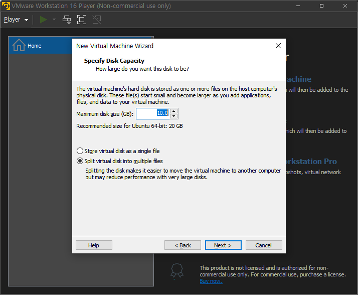

# Window환경에서 ubuntu 설치하기
> ## 환경
- 윈도우10 64비트 
> ## 사전 준비
- Ubuntu 공식 iso를 https://ubuntu.com/download/desktop 에서 다운받는다.
- Vmware를 https://www.vmware.com/kr/products/workstation-player/workstation-player-evaluation.html 에서 다운받고 설치한다.
- Git bash를 https://git-scm.com/downloads 에서 설치한다. 
> ## 설치 과정
1. ### Vmware를 실행합니다.
    
    

2. ### Create a New Virtual Machine을 클릭합니다.
    
    

3. ### Browse...를 누르고 사전 준비에서 받아놓은 ubuntu iso파일을 선택합니다.
    
    

4. ### Full name, User name, password, Confirm(password 확인)을 입력합니다.
    

    #### 주의) User name은 소문자이거나 숫자여야 합니다.
    
    
    

5. ### Virtual machine name을 입력합니다.
    
    

6. ### 가상 머신에서 사용할 용량을 고릅니다. 
    single file, multiple files가 있는데 single파일이 성능상 유리하지만 미미할 것이므로 multiple files로 골랐습니다.
    
    

7. ### Finish를 고르면 끝.
    
    

8. ### 오랫동안 기다리고...
    
    
    

9. ### 설정했던 full name을 고르고 password를 입력하면 접속 성공
    
    

10. ### 접속 후 terminal을 찾아 우분투의 ip주소를 얻기 위해 ifconfig를 쳐보았지만 설치되어 있지 않아 sudo apt install net-tools를 타이핑해서 설치합니다.
    
11. ### 또한, 이 우분투를 서버로 이용할 것이므로 openssh-server를 설치합니다.
    
    

12. ### ifconfig를 입력해서 ip를 확인하고
    
    

13. ### 윈도우에 설치되어 있는 git bash에 ssh [username]@[ip주소]를 입력하면
    

    이렇게 뜨고 yes를 눌러주고 password를 입력하면 ssh 연결 성공!

    이 때 입력한 비밀번호는 화면상에 나타나지 않으니 그냥 입력 후 enter 누르면 됩니다.
    
    

14. ### ~~그 후 root인 / 에 디렉토리를 만들 권한이 없으니 sudo 를 이용해 backup 폴더를 만들고 764권한을 주는 명령은 다음과 같습니다.~~ 
    ### => scp로 백업파일을 local에서 서버로 보낼 때 권한을 줄 수가 없어서 ~/ 에 backup 디렉토리를 만들었습니다.
    ~~sudo mkdir /backup~~

    => sudo mkdir ~/backup

    ~~sudo chmod 764 /backup~~

    => sudo chmod 764 ~/backup
    

15. ### script 파일에는 
    > 스크립트 진행 도중에 .cs 파일이 없는 디렉토리가 있으면, 어느 디렉토리가 없는지 문구를 출력한다.
    ### 이 조건은 수행하지 못하고, /backup 파일로 보낼 때 권한문제가 있어서 ~/backup 파일로 보내는 것을 수행하는 쉘 명령어가 포함되어 있다.
